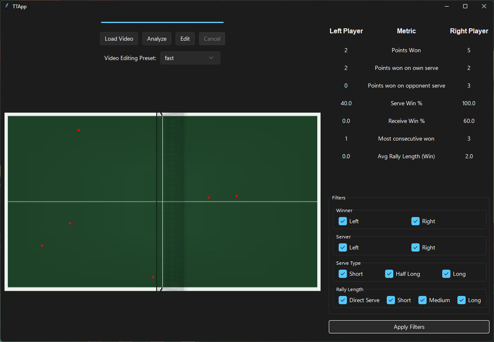
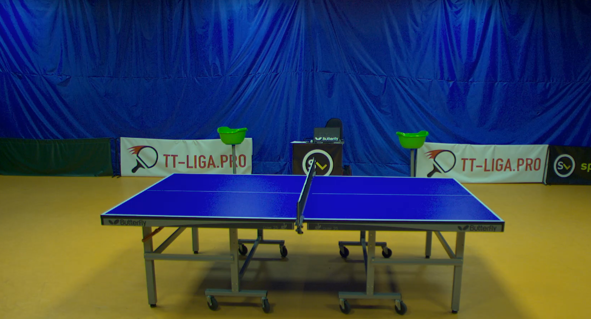

# TTVision

TTVision is a tool for analyzing and editing table tennis matches from video recordings. 




## Overview

TTVision provides two primary capabilities:

* **Analysis** – Extracts statistics and winning bounce positions from table tennis games.
* **Editing** – Automatically edits out dead time from videos, leaving only playing time. 


If you are using Windows and have installed FFmpeg, you can simply run the application after downloading it from the releases tab. Make sure to place the executable in a folder where administrator permissions are not required, as that's where TTVision will attempt to save the edited video.

If you only wish to edit videos and want to do so from the terminal, you can run the following commands:

```
pip install -r requirements.txt
```

```
python edit_video.py "path\to\video" --preset your_preset_choice
```

The available preset options can be found at: https://trac.ffmpeg.org/wiki/Encode/H.264

Because the system relies on visual detection of the table and ball, **camera placement and recording conditions are critical** for reliable results. Take a look at the "assumptions" section below. 


## Requirements

* **FFmpeg** (required for video processing)
  https://ffmpeg.org/download.html

Installation instructions are also available at: https://github.com/oop7/ffmpeg-install-guide


FFmpeg must be available in your system PATH or accessible by the application, as it is needed for video editing.


## General recording assumptions

* The camera is **static after the 30 second initialization phase.** If the camera or the table is moved after that, it will lead to **analysis and editing mistakes**
* **The surface of the table is visible**


## Video editing assumptions
* **Editing  should theoretically work from any angle**
* **The table is fully visibile during dead times and it is ideally not covered by people**


## Video analysis assumptions



* **Filmed from side angle, as shown above**
* **Only one, white ball** is visible in the frame
* **Players do not switch sides during the recording**
* **Serves are legal**
* **Minimal glare on the table surface**
* **Table contrasts clearly with the background**


## Limitations

TTVision may fail or produce unreliable results when:
* The camera moves after the setup period
* Table surface is not visible
* Players or objects block the table
* Multiple balls appear in the frame
* The table color blends with the environment
* Excessive glare or reflections are present

During analysis, let points or players tossing the ball across the table might be counted as points, which is why more points might be found than what were actually played.


## Future Improvements

Potential future features include:

* Support for additional camera angles
* Support for matches where players switch sides
* Stroke-based stats, such as % of points won using backhand flick

## Acknowledgements

juicy_fish on Flaticon for the desktop icon: https://www.flaticon.com/authors/juicy-fish

This project uses segmentation weights derived from
the TT3D project by the Cognitive Systems Group at the University of Tübingen:

https://github.com/cogsys-tuebingen/tt3d